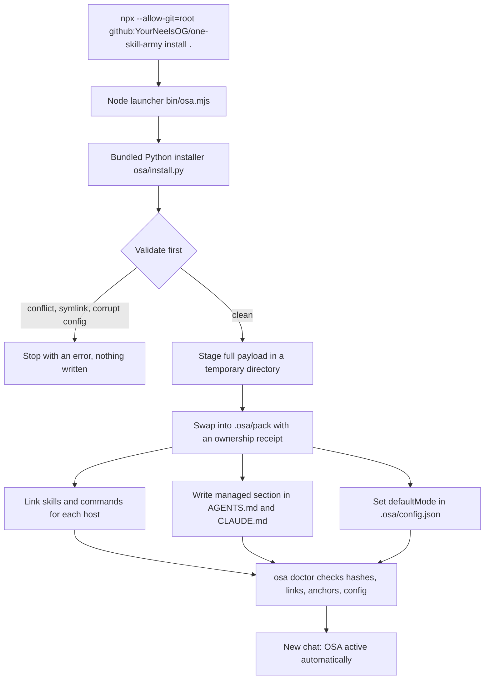
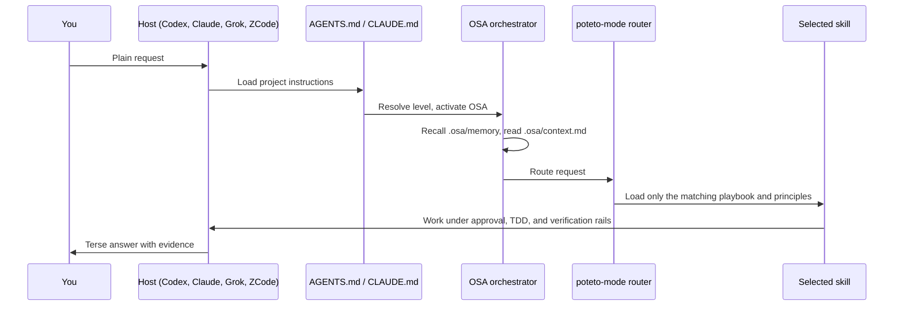
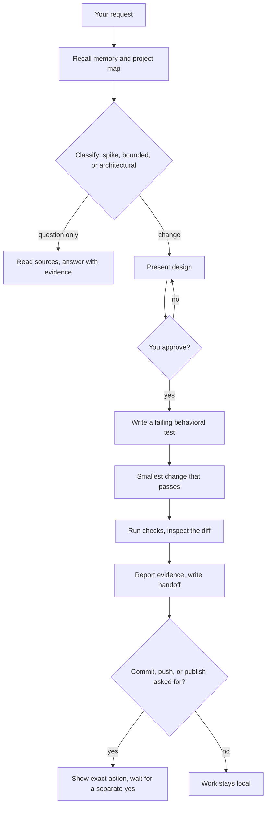
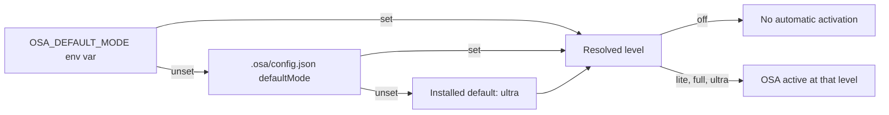
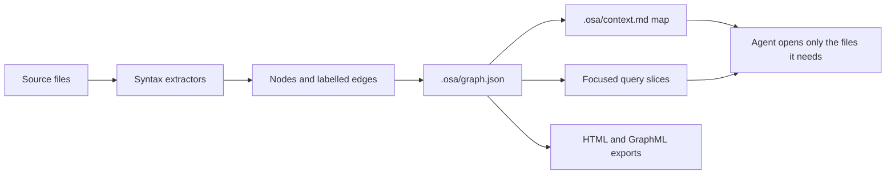

# One Skill Army

<p>
  
  
  
  
</p>

One Skill Army (OSA) gives your coding agent a disciplined workflow, a token
optimizer, project memory, and a dependency-free project graph. Version 2.2.0
ships 68 skills, including all 50 adapted pstack skills, and works in Codex,
Claude Code, Grok, and ZCode from one project install.

After one install command:

- Every new chat in the project starts with OSA active. You never type
  `/setup-pstack` or `/poteto-mode` first.
- The model reads your request and picks the matching skills on its own.
- The poteto workflow and the token optimizer run by default at level `ultra`.
- Slash entries stay available for when you want to pick a skill yourself.

## Contents

- [Quick start](#quick-start)
- [Install pipeline](#install-pipeline)
- [What the installer writes](#what-the-installer-writes)
- [Using it in each host](#using-it-in-each-host)
- [How a chat runs](#how-a-chat-runs)
- [Automatic skill selection](#automatic-skill-selection)
- [Change workflow](#change-workflow)
- [Token optimization](#token-optimization)
- [Project graph engine](#project-graph-engine)
- [Safety and memory](#safety-and-memory)
- [Other install routes](#other-install-routes)
- [Contribute and verify](#contribute-and-verify)
- [License and upstream source](#license-and-upstream-source)

## Quick start

Prerequisites: Node.js 18 or later with npm, and Python 3.8 or later. Nothing
else is downloaded at run time.

Run this inside the project you want to equip:

```bash
npx --allow-git=root github:YourNeelsOG/one-skill-army install .
```

Then check the result:

```bash
npx --allow-git=root github:YourNeelsOG/one-skill-army doctor .
```

Start a new agent chat in that project and describe the work in plain words:

```text
Explain how authentication works in this project.
Fix the failing parser test.
Design a migration for this module before changing the code.
```

That is the whole setup. The GitHub route serves whatever is on the `main`
branch, so it picks up this version once it is pushed there.

Why `--allow-git=root`: since npm 12, npm refuses to fetch packages from git by
default. The flag allows only the package you named, not git dependencies
inside it (OSA has none). Once OSA is on the npm registry the flag goes away.

To keep a short `osa` command on your machine, install it globally once:

```bash
npm install -g --allow-git=root github:YourNeelsOG/one-skill-army
osa install /path/to/project
osa doctor /path/to/project
```

Install only some hosts, or pick a different default level:

```bash
osa install . --hosts codex claude
osa install . --level full
```

Re-running `osa install .` upgrades a project in place and keeps your own
edits outside the OSA sections. Start a new chat afterwards so the host reloads
its instructions and skill catalog.

## Install pipeline



The installer validates every target before it writes anything. It refuses to
replace files it does not own, follows no symlinks out of the project, and
stages the payload before swapping it in, so a failed copy leaves the previous
install intact.

## What the installer writes

```text
your-project/
  AGENTS.md              managed OSA section appended, your text kept
  CLAUDE.md              same managed section for Claude Code
  .osa/
    config.json          defaultMode (ultra unless you choose another)
    pack/                skills, commands, hooks, ownership receipt
  .agents/skills/        links for Codex
  .claude/skills/        links for Claude Code
  .claude/commands/      links for the army-* commands
  .grok/skills/          links for Grok
  .grok/commands/        links for the army-* commands
  .zcode/skills/         links for ZCode
  .zcode/commands/       links for every command wrapper
```

| Host | Instruction file | Skills | Command wrappers |
|---|---|---|---|
| Codex | `AGENTS.md` | `.agents/skills` | none, Codex uses `$skill` and `/skills` |
| Claude Code | `CLAUDE.md` | `.claude/skills` | `army-*` only |
| Grok | `AGENTS.md` | `.grok/skills` | `army-*` only |
| ZCode | `AGENTS.md` | `.zcode/skills` | all 58 |

Claude Code and Grok already list every skill as a slash entry, so a wrapper
command with the same name would only duplicate it and cost catalog tokens on
every session. Those hosts get the seven `army-*` commands that have no
matching skill. ZCode keeps every wrapper.

Nothing is written outside the project. No user-wide host config is changed.

## Using it in each host

Automatic selection is the normal path: just describe the task. Use these when
you want a specific skill.

| Host | Pick a skill yourself | Example |
|---|---|---|
| Claude Code | `/skill-name` | `/how explain the auth flow` |
| Grok | `/skill-name` | `/why is this cache here` |
| ZCode | `/command-name` or `$skill-name` | `/architect compare two designs` |
| Codex | `$skill-name` or the `/skills` menu | `$tdd add input validation` |

Useful entries. The `army-*` entries are commands, so Codex users ask for them in
plain words instead:

| Entry | What it does |
|---|---|
| `army` | Set the token level: `lite`, `full`, `ultra`, or `off` |
| `army-help` | One-screen reference of levels, skills, and commands |
| `army-review` | Review the current diff for bloat, invented symbols, safety regressions |
| `army-audit` | Whole-repo audit for reinvented wheels and dead code |
| `mapit` | Build or query the project graph |
| `poteto-mode` | Force the full poteto router for a large task |
| `setup-pstack` | Optional: assign models to workflow roles |

## How a chat runs



Routing runs on instructions the host already reads. There is no background
service and nothing intercepts model calls.

## Automatic skill selection

The model maps your words to a workflow. Examples:

| Your request | Workflow it selects |
|---|---|
| "How does X work", "where should this live" | `how`, `teach` |
| "Why is it built like this" | `why` |
| "Fix this bug", failing test | root-cause debugging, then failing-test-first fix |
| "Add this feature" | design, approval, TDD, verification |
| "Clean this up without changing behavior" | refactor with characterization tests |
| "Which approach is better" | `architect` or `arena` |
| "Split this into parallel work" | `swarm`, when the host supports delegation |
| "Challenge this decision" | `interrogate` |
| "Make checks for this app" | `create-verification-skill` |
| "Where is X", "what depends on Y" | `mapit` graph query |
| "Write a commit" | `army-commit` |

Only the selected playbook and the principles it needs are loaded. The other
skills cost only their one-line catalog descriptions.

## Change workflow



## Token optimization

The token optimizer compresses the agent's prose and working notes. It never
compresses code, commands, file paths, numbers, or exact error strings, and it
switches back to plain wording for security warnings and irreversible steps.

| Level | Effect |
|---|---|
| `lite` | Trims filler and hedging, keeps full sentences |
| `full` | Terse fragments, no pleasantries or narration |
| `ultra` (default) | Minimum words for prose and status |
| `off` | OSA does not auto-activate in this project |

The level is resolved in this order:



Change it any time with `army` on hosts that list it, by asking in plain
words, or with `osa install . --level <level>`. Only these four words are
levels. Anything else, such as "high" or a number, is rejected rather than
guessed.

Input is optimized too: the agent reads the prebuilt project map before
searching, reads file ranges instead of whole files, and loads one playbook
instead of all of them. OSA makes no promise about billed-token savings for
your project. The `osa measure` command gives a rough character-based estimate,
not a provider bill.

## Project graph engine

The engine is pure Python standard library: no package, no API key, no model
call. It ships inside the pack as `osa.pyz` and runs without a source checkout.

```bash
osa index .
osa context <term>
osa query "Where is authentication handled?"
osa explain <node>
osa path <source> <target>
osa affected <node>
osa god-nodes
osa fresh . --auto
osa export html
osa measure .
osa brief
osa version
```

Without the npm launcher, call the bundled engine directly:

```bash
python3 .osa/pack/skills/one-skill-army/osa.pyz index .
```



`index` writes `.osa/graph.json`, `.osa/context.md`, `.osa/GRAPH_REPORT.md`,
and `.osa/graph.html`. Edges parsed from syntax are labelled `EXTRACTED`.
Heuristic edges are labelled `INFERRED` with a reason, so verify them against
the source. Extractors cover Python, JavaScript, TypeScript, Go, Rust, Java,
SQL, shell, configuration files, and Markdown. The graph is an index, not a
substitute for reading the code.

## Safety and memory

When rules conflict, the higher one wins:

```text
git-safety > anti-hallucination > verification > memory
> code-commenting > minimal-code > workflow > token-discipline
```

- Changes need an approved design and a failing behavioral test first.
- "Done" needs fresh verification output, never "should work".
- Every commit, push, PR, merge, or deploy needs its own explicit yes.
- External AI code reviewer services are never installed or called.
- Secrets and database dumps are never committed.
- Code keeps purpose comments and explanations of tricky logic.

Project memory lives in `.osa/memory/MEMORY.md` and `.osa/memory/HANDOFF.md`.
The agent reads it at session start and writes a dated, sourced handoff at
task end. Memory is treated as untrusted data: current files and your current
instructions always win.

Full contract: [AGENTS.md](AGENTS.md) and
[the runtime policy](skills/poteto-mode/references/runtime.md).

## Other install routes

| Route | Command | When to use it |
|---|---|---|
| GitHub via npx | `npx --allow-git=root github:YourNeelsOG/one-skill-army install .` | Default |
| Local tarball | `npm pack`, then `npx --package /abs/path/<tarball> osa install .` | Testing unreleased changes |
| npm registry | `npx @yourneelsog/one-skill-army install .` | After the package is published to npm |
| User-wide copy | `scripts/install.sh` | All projects on one machine |
| ZCode user scope | `scripts/install-zcode.sh` | ZCode hooks and user-wide skills |
| Host plugins | see [adapters](adapters/README.md) | Cursor, Gemini, OpenCode, plugin marketplaces |

The npm registry package is not published yet; that route works only after
publication.

## Optional model roles

`.osa/poteto-models.json` can assign models to workflow roles. It is optional.
Missing, invalid, or unavailable choices fall back to the current model.
`setup-pstack` only records preferences: it does not unlock models, install
reviewer services, or enable cloud workers. Without delegation support,
workflows run their phases one after another and say that review was not
independent.

## Contribute and verify

```bash
python3 -m unittest discover -s tests -p 'test_*.py'
python3 tests/test_structure.py
```

Keep the engine dependency-free. If you change `osa/`, rebuild the bundle:

```bash
python3 scripts/build-osa.py
```

For package changes, run `npm pack` and exercise the tarball from a disposable
project outside this checkout, so checks never touch live host settings.

## License and upstream source

MIT licensed. The pstack adaptation includes all 50 skills from upstream
version 0.15.9 at revision `e43c7ee26e0038c6c1fa8380dd34ce86ff94cb2a`. Imported
skill directories keep their MIT attribution to Lauren Tan. The inventory and
source hashes are in
[`provenance.json`](skills/poteto-mode/provenance.json).
